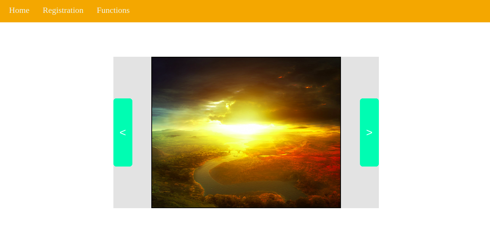

# AKVELON FRONTEND INTERNSHIP 3 BULAT SAFIULLIN

React application with slider, registration form and function tasks. All available on different pages. To see next slide, use green arrow buttons. To complete registration, fill the forms.

<a href="https://bullet03.github.io/akvelon_frontend_internship_3_bulat_safiullin/">DEMO<a>

- React v17 (CRA).
- Routing.
- CSS modules.

### To Run Locally

- clone the repo;
- use npm install/yarn to install all the dependencies
- use npm start/yarn start to run locally